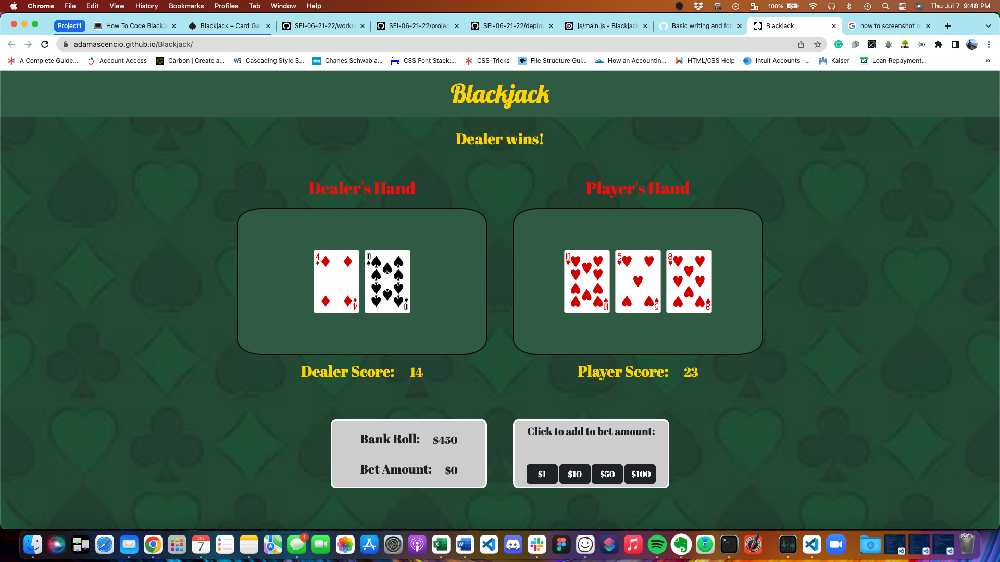
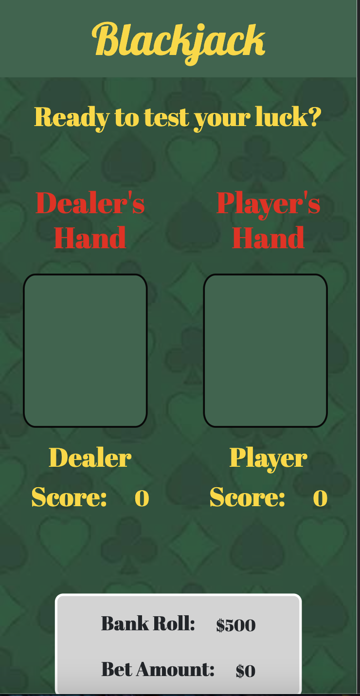

# Blackjack
Blackjack is a well known card game also known as Twenty-One. The player is dealt two cards from a randomly shuffled, 52-card deck. The dealer is also dealt two cards from the deck with one card faced downwards. The player can then choose to either hit or stay. If the player hits, they are dealt another card. If the player stays, the dealer will then hit or stay. The dealer will hit until the total is 17 or greater. If either the dealer or player go over 21, they lose. If the player wins, the player receives the bet. If the player loses, the player loses the bet. If the first two cards drawn add to 21, the player wins.

# Screenshots

# Technologies Used
- JavaScript
- HTML
- CSS
- CardStarter CSS Library
- Bootstrap

# Getting Started
[Click to Play Blackjack](https://adamascencio.github.io/Blackjack/)

# Next Steps
- Update styling to fit bet buttons and bet totals in the screen on mobile
- Add additional blackjack rules to the game such as splitting, double down, and busting
- Fix bug that indents bank roll and bet totals when a button is selected to increment the bet amount
- Increase font size of cards on mobile displays
